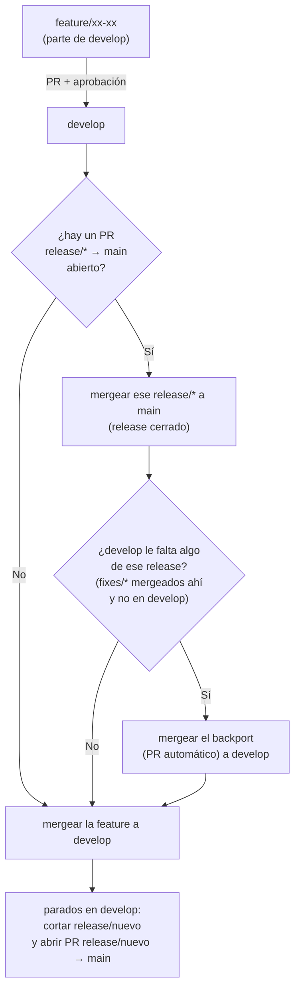

# Guía de flujo de trabajo (GitFlow de Livingshop)

Esta guía explica cómo trabajamos en este repositorio: qué ramas existen, cómo se abre y mergea una feature, y cómo funciona el proceso de release. Si es tu primera vez acá, leela entera antes de tu primer PR.

## Ramas

| Rama | Para qué sirve | Se parte desde | Recibe merges de |
|---|---|---|---|
| `main` | **Intocable.** Es lo que está en producción. | — | Solo `release/*` (vía PR) |
| `develop` | Rama de integración. Todo lo que se viene desarrollando vive acá. | `main` (ya existe, no la recrees) | `feature/*`, `backport/*` (vía PR) |
| `feature/xx-xx` | Una feature nueva. | `develop` | — |
| `release/xx` | Un release en preparación, listo para salir a producción. | `develop` | `fixes/xx-xx` (directo, sin PR intermedio a develop) |
| `fixes/xx-xx` | Un arreglo puntual sobre un release ya cortado (ej. algo que encontró QA). | `release/xx` | — |
| `backport/...` | Generada automáticamente por CI para traer a `develop` lo que se arregló en un `release/*`. | `develop` | — |

Nada de esto se pushea directo a `main` ni a `develop` — todo entra por PR, con al menos 1 aprobación.

## El ciclo completo



## Paso a paso: desarrollar una feature

1. Actualizá tu `develop` local y cortá tu rama:
   ```bash
   git checkout develop
   git pull
   git checkout -b feature/123-nombre-descriptivo
   ```
2. Trabajá y commiteá normalmente.
3. Cuando termines, abrí un PR **`feature/123-...` → `develop`**.
4. Pedí review. Una vez aprobado, **antes de mergear**, fijate si hay un PR `release/* → main` abierto ahora mismo:
   - **No hay ninguno abierto** → mergeá tu PR a `develop` directo. Después, parado en `develop`, cortá el próximo release (ver más abajo).
   - **Hay uno abierto** → seguí estos pasos en orden:
     1. Mergeá ese `release/* → main` (esto cierra el release).
     2. Fijate si CI abrió un PR de backport (`backport/... → develop`) — lo abre solo si `main` tiene algo que `develop` todavía no tiene (típicamente, `fixes/*` que se mergearon directo al release). Si lo abrió, revisalo y mergealo primero. Si hay conflictos, el mismo PR te lo va a marcar — bajate la rama, resolvé, y pusheá al mismo branch del PR.
     3. Recién ahí mergeá tu PR de feature a `develop`.
     4. Parado en `develop` (con la feature y el backport ya adentro), cortá el próximo release.

## Cortar un release

Parado en `develop` al día:

```bash
git checkout develop
git pull
git checkout -b release/xx
git push -u origin release/xx
```

Abrí un PR **`release/xx` → `main`**. Este PR queda abierto mientras se estabiliza el release (QA probando, etc.) — es "el release abierto" que se chequea en el paso anterior.

## Arreglar algo en un release ya cortado

Si mientras un release está en estabilización aparece un bug:

```bash
git checkout release/xx
git pull
git checkout -b fixes/456-nombre-del-bug
# arreglás, commiteás
git checkout release/xx
git merge fixes/456-nombre-del-bug
git push
```

`fixes/*` se mergea **directo a `release/*`**, no a `develop` — por eso existe el paso de backport: ese arreglo tiene que volver a `develop` en algún momento, y CI se encarga de detectarlo y armar el PR automáticamente en cuanto el release se mergea a `main`.

## Qué es automático y qué no

- ✅ **Automático:** cuando un `release/*` se mergea a `main`, un workflow de CI compara `main` contra `develop` y, si hay diferencia, abre el PR de backport solo. Nunca lo mergea.
- ✅ **Automático:** cualquier PR a `main` que no venga de una rama `release/*` falla un check obligatorio y no se puede mergear.
- ❌ **Manual, siempre:** mergear `release/* → main`, mergear `feature/* → develop`, mergear `backport/* → develop`, y decidir cuándo cortar el próximo release. Todo pasa por PR con aprobación humana — nada se automergea.

## Reglas duras

- `main` nunca recibe un push directo, ni un merge que no venga de `release/*`.
- `develop` nunca recibe un push directo.
- Nombrá las ramas con el prefijo que corresponde (`feature/`, `release/`, `fixes/`) — el check de CI en `main` depende del prefijo `release/` para dejar pasar un PR.
