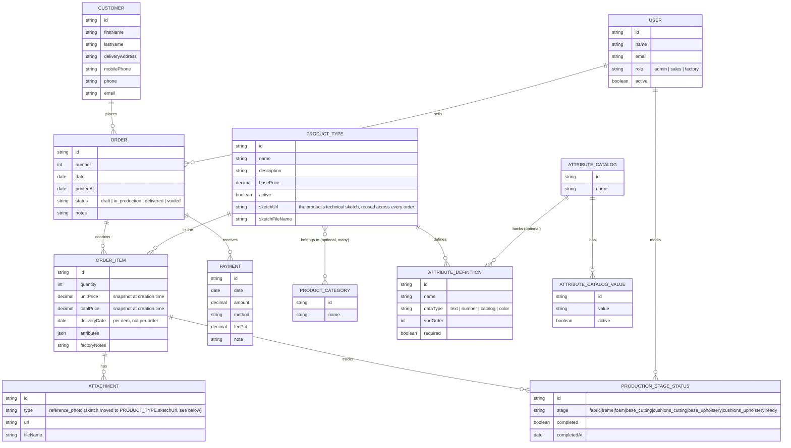

# Architecture

Technical reference for how the codebase is organized. For the product/business context, see `DISENO.md`. For the reasoning behind specific choices, see `DECISIONS.md`. This file assumes the reader has read the root `CLAUDE.md` first.

## Data model



Things that are easy to miss reading the schema alone:

- **`ProductType` ↔ `ProductCategory` is many-to-many and optional.** A product can have zero, one, or several categories; there is no `categoryId` column. Backend list/filter endpoints and the frontend `CategorySelector` both assume this.
- **Price is snapshotted per `OrderItem`, not looked up live.** `OrderService.buildCreateData` reads `ProductType.basePrice` once, at order-creation time, and copies it into `unitPrice`/`totalPrice`. Editing a product's price afterwards (individually or via the percentage-increase endpoint) never touches existing orders.
- **`deliveryDate` lives on `OrderItem`, not `Order`.** A single order can bundle products with different delivery dates (e.g. one item delivered immediately, another in 30 days). The order-creation form defaults every new item's date to today and offers a "same date for all items" convenience toggle, but the API always stores it per item.
- **`attributes` is a JSON blob shaped by `AttributeDefinition`.** Each `ProductType` declares its own attribute schema (name, `dataType`, whether it's required, and — for `dataType: "catalog"` — which shared `AttributeCatalog` supplies the dropdown values). The order form renders inputs dynamically from this schema and also allows the salesperson to add ad-hoc key/value pairs beyond the defined schema; the API does not currently validate that extra keys are absent, only that required ones are present.
- **`ProductionStageStatus` stages are a fixed enum**, not configurable per product type. Every `OrderItem` can have a status row for each of the 8 stages; the production board/report simply shows unchecked for stages that were never marked.
- **The technical sketch/croquis belongs to `ProductType`, not `OrderItem`.** `ProductType.sketchUrl`/`sketchFileName` hold one image per product, managed from the product's edit modal (`POST`/`DELETE /product-types/:id/sketch`, admin-only) and reused automatically by every order that includes that product — the factory sheet PDF resolves it via `OrderItem.productTypeSketchUrl`. `OrderItem`'s own `Attachment`s are reference photos only (`type: "reference_photo"`) — evidence specific to that sale, not the product's design; the `sketch` attachment type still exists in the DB enum for historical rows but the API no longer accepts it.
- **Every image upload (sketches and reference photos alike) is restricted to JPG/PNG.** Both can end up embedded in a PDF via `@react-pdf/renderer`, which doesn't decode WEBP.
- **`Order` API responses include a `customerFullName`**, joined from the `customer` relation in `PrismaOrderRepository`'s shared `orderInclude` — it isn't a column on `Order` itself, just a convenience field so list/detail views don't need a second lookup to show a name.

## API layering (`apps/api/src`)

Dependency direction is strictly one-way: `presentation → application → domain`, and `infrastructure → domain`. Nothing in `domain/` imports from any other layer.

```
domain/
  entities/        plain TS interfaces + enums (no behavior)
  repositories/     interfaces only — the "ports" every Prisma*Repository implements
  policies/         pure functions with real business rules (order totals, production-board pricing strip)
  errors/           DomainError subclasses, thrown from application/domain, mapped to HTTP by errorHandler

application/<module>/<Module>Service.ts
  one service per module (orders, catalog, customers, production, sales, pdf, attribute-catalogs, users)
  depends on domain repository *interfaces*, never on Prisma directly
  this is where validation lives (required attributes, non-negative prices, percentage bounds, ...)

infrastructure/
  repositories/Prisma*Repository.ts   implements the domain repository interfaces with Prisma
  pdf/                                  @react-pdf/renderer templates + the renderer that fills them
  storage/LocalFileStorage.ts          saves uploaded attachments to disk, returns a public URL
  database/prisma.ts                    the shared PrismaClient instance

presentation/http/
  controllers/    parse the request (Zod validators), call the application service, shape the response
  validators/      Zod schemas for request bodies and list-query params
  routes/          Express Router factories, one per module, each declaring its own requireRole(...) gates
  middlewares/     currentUser (resolves x-user-id → domain User) and requireRole (403s otherwise)

app.ts   composition root — instantiates every repository, service, controller, router by hand and mounts them
server.ts   just calls createApp() and .listen()
```

There's no dependency-injection framework: `app.ts` is the single place where concrete classes get wired to interfaces. Adding a module means adding one file per layer and one wiring block in `app.ts` — there's no other registration mechanism to remember.

### Request flow example (order creation)

1. `POST /api/orders` hits `orders.routes.ts` → `requireRole("admin", "sales")` → `orders.controller.ts#create`.
2. The controller parses the body with `orderInputSchema` (Zod) and calls `OrderService.create`.
3. `OrderService.buildCreateData` validates the customer/salesperson/product types exist, checks required attributes per item, and resolves each item's `unitPrice`/`totalPrice` from the current `ProductType.basePrice`.
4. `PrismaOrderRepository.create` persists the order + items in one Prisma call.
5. The controller returns the order plus `computeOrderTotals(order)` — the same full shape (pricing and payments included) regardless of the caller's role; `requireRole` is what actually keeps `factory` off this route.

### Pagination shape

Rule of thumb: **any list whose size grows with business activity (orders, customers, sales, production items) must be paginated at the database query — `skip`/`take` plus a `count()`, never a `findMany()` with no limit.** Catalog/reference data that's inherently small and doesn't grow with transaction volume (product types, product categories, attribute catalogs — realistically dozens to a few hundred rows, set up once and edited rarely) is the one exception where fetching everything is fine. The failure mode this avoids: a `findMany` with no `skip`/`take` looks correct with 10 seed rows and quietly turns into a multi-second query and a multi-MB response once the table has thousands of rows — pagination in the _UI_ (`DataTable`'s client mode) doesn't help here, because by then the whole dataset has already crossed the wire.

Every paginated endpoint (`GET /orders`, `GET /product-types`, `GET /product-categories`, `GET /customers`, `GET /sales`, `GET /production/board`) returns the same shape:

```ts
{ items: T[], total: number, page: number, pageSize: number }
```

`PrismaOrderRepository`, `PrismaCustomerRepository`, etc. build the `where` clause from the query's search/filter params (case-insensitive `contains` for text, exact match for order numbers) and run the `findMany`/`count` pair inside `Promise.all`. Search inputs on the frontend debounce via `useDebouncedValue` before firing the query, so typing doesn't send one request per keystroke.

`GET /orders` also accepts `sortBy` (`date` | `number` | `deliveryDate`) and `sortDirection`. Sorting by `number`/`date` is a normal Prisma `orderBy`; sorting by `deliveryDate` — the earliest `deliveryDate` across an order's items — needs a raw SQL query instead, since Prisma can't order a parent list by a `MIN` aggregate over a to-many relation (`PrismaOrderRepository#listSortedByDeliveryDate`). `DataTable` renders a column as a clickable, sort-indicator-bearing header whenever its `sortKey` is set and the page passes a `sort` prop; `OrdersListPage` is the only page using it today.

Two categories of exception, both deliberate:

- **`/all` routes** (`GET /product-types/all`, `GET /product-categories/all`) return a plain unpaginated array. These back `ProductTypePicker` and `CategorySelector`, which need the _whole_ catalog client-side for instant filtering — safe because that catalog is small reference data (see rule above), not something that scales with orders.
- **PDF generation** (`OrderRepository.listAllItemsWithContext`, `listAllSalesRows`) intentionally fetches everything with no limit, because a printed production/sales sheet is a full-scope document, not an interactive list — a "page 1 of 40" PDF wouldn't make sense. These are separate repository methods from the paginated ones the UI uses (`listItemsWithContext(query)`, `listSalesRows(query)`), so the printed-document need doesn't force the interactive list to load everything too.

`CustomerPicker` searches the paginated `GET /customers?search=...` endpoint itself (debounced), rather than filtering a fully-loaded customer list client-side — the same way `OrderDetailPage` fetches a single customer by id (`GET /customers/:id`) instead of loading everyone to find one. Both matter because customer count scales with order volume.

The production board (`GET /production/board`) filters to `status: { in: ["draft", "in_production"] }` — delivered/voided orders are done — so factory staff only ever see active work.

## Web layering (`apps/web/src`)

```
api/          one file per resource; thin wrappers around client.ts's apiFetch/apiGet/apiPost/...
              client.ts attaches the mock x-user-id header (from currentUserStore.ts) to every request
              and exposes toQueryString() for building paginated/filtered GET URLs.
              main.tsx's QueryClient overrides the default retry policy to skip 4xx errors — those
              fail identically on retry, so retrying them just made the UI look stuck loading

auth/         CurrentUserContext (who's "logged in" — just a header value persisted to localStorage),
              routeRoles.ts (single source of truth for which roles can see which route),
              homeRoute.ts (where each role lands after switching users)

components/   shared, page-agnostic UI:
              DataTable        generic table, explicit per-column pixel/percent widths, server- or
                                client-mode pagination — every list page in the app uses this.
                                Server mode is the default for anything that scales with business
                                activity (orders, customers, sales, production); client mode is only
                                for genuinely small lists (e.g. attribute catalog values) — see
                                "Pagination shape" below
              Modal            every create/edit form opens in one of these, never inline in the page
              CategorySelector search box + "top N by product count" + explicit select-all (multi-select),
                                used for picking a product's categories and for the price
                                percentage-increase filter
              CategoryFilterSelect   single-select sibling of CategorySelector, for the products list's
                                category filter — same search-first, top-N-by-count pattern, one pick
              CatalogValueSelect   search-to-pick combobox over one attribute catalog's values (e.g. a
                                fabric/color catalog), used in the order form wherever an attribute's
                                dataType is "catalog" — a native <select> doesn't scale once a catalog
                                has 100+ values
              CustomerPicker / ProductTypePicker   type-to-search selection, no inline "create" for products.
                                CustomerPicker searches the server (debounced, via useDebouncedValue)
                                since customers scale with orders; ProductTypePicker filters the small
                                unpaginated product catalog client-side.
              FileInput        <input type="file"> styled via Tailwind's file: variant so the native
                                "choose file" control reads as an actual button
              Collapsible, ui.tsx (Card/Button/Input/...)   low-level building blocks

pages/        one file per route, composed from the above
```

`RequireRole` (in `components/`) wraps each `<Route>` in `App.tsx` and redirects to `homeRouteForRole()` if the current user's role isn't in that route's list from `routeRoles.ts` — this is the only place route access is enforced on the frontend (the API enforces it independently via `requireRole` middleware, so the frontend check is UX-only, not a security boundary).

## PDF generation

`infrastructure/pdf/templates/*.tsx` are `@react-pdf/renderer` components (not HTML — a separate PDF-specific element tree: `Document`, `Page`, `View`, `Text`). `ReactPdfRenderer.tsx` renders each template to a `Buffer` on demand; there's no caching or background generation. Four documents exist:

- **Order sheet** — customer-facing, one row per item with its own delivery date and price. Header is the "Livingshop" brand + order number/date; the customer's name and contact details are their own block in the body.
- **Factory sheet** — technical spec per item plus its product's sketch image (`OrderItem.productTypeSketchUrl`) and any reference photos attached to that item, both inlined from `LocalFileStorage`. Header is the order number (large/bold, standing in for the brand treatment the order sheet uses) with the customer's name secondary — the reverse of a typical letterhead, since factory staff care which order this is before whose it is. Print date/time and each item's delivery date use a larger, bolder style than the rest of the document's metadata, since those are the two dates factory staff actually act on, and the print date includes the time because the sheet can be reprinted more than once in a day.
- **Production sheet** — the print-friendly version of the production board (checkboxes per stage), sourced from `OrderRepository.listAllItemsWithContext()` (the unbounded variant — see "Pagination shape").
- **Sales sheet** — payment status per order, sourced from `OrderRepository.listAllSalesRows()` (same reasoning).

All four are in Spanish, matching the web UI, since they're read by Livingshop staff and customers.

`application/pdf/fileName.ts` builds a descriptive filename for each document (document type, order number where relevant, customer, and a date/time stamp — e.g. `ficha-tecnica_orden-7901_paula-osorio_2026-08-12_17-12.pdf`) instead of a generic name. `PdfService`'s methods return `{ buffer, fileName }`, and `pdf.controller.ts#sendPdf` serves that filename via `Content-Disposition: attachment` — not `inline` — since browsers largely ignore an `inline` disposition's filename hint once the user saves from the viewer's own controls.
